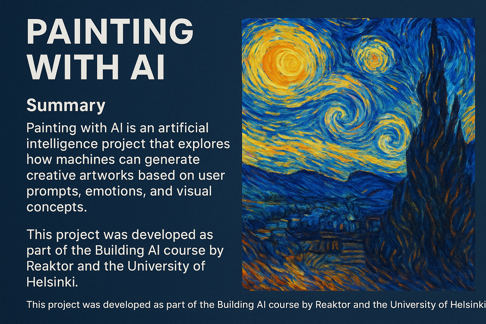

# Painting with AI

  

## Summary
Painting with AI is an artificial intelligence project that explores how machines can generate creative artworks based on user prompts, emotions, and visual concepts.  
It demonstrates how AI can analyze artistic patterns, learn from famous styles, and produce new, unique digital paintings.  
This project was developed as part of the Building AI course by Reaktor and the University of Helsinki.

---

## Background
Art and creativity have long been considered uniquely human abilities. However, with the rise of deep learning and neural networks, machines are now capable of producing art that rivals human imagination.  
This project aims to combine **AI and art** by generating paintings that reflect both **human emotion** and **computational creativity**.

I chose this topic because I’ve always been fascinated by how technology can enhance creativity and help people express ideas visually through algorithms.

---

## How is it used?
The user can:
1. Provide a **text prompt** (e.g., “A sunset over the ocean in Van Gogh style”) or upload an image.
2. The AI model processes the input using **neural style transfer** or **text-to-image generation**.
3. The program outputs a **painting-like image** inspired by classic or abstract art styles.

This can be used by:
- Digital artists who want quick visual inspiration  
- Students learning about AI and creativity  
- Designers experimenting with art generation models

---

## Challenges
- Selecting suitable neural networks for realistic artistic output  
- Balancing computation cost and image quality  
- Preventing overfitting on one artistic style  
- Understanding subjective evaluation — what makes a painting “beautiful” to different users  

---

## What next?
In the future, this project could include:
- A **web app interface** for live image generation  
- **Emotion-based** painting generation (using sentiment detection)  
- **Community gallery** where users can share AI-created art  
- Integration with **Stable Diffusion** or **DALL·E** models  

---

## Acknowledgments
- **Reaktor & University of Helsinki** – Building AI course  
- **TensorFlow & PyTorch** communities  
- **OpenAI & Stability AI** for their contributions to generative models  
- All fellow learners who provided feedback during development  

---

## Author
**Gayathri Prasanna Kumar**  
📧 [Your Email or GitHub Profile]  
🌐 [Building AI Course – Reaktor x University of Helsinki]

---

> “Art is not only created by humans anymore — it’s co-created with intelligence.” 🖌️🤖
